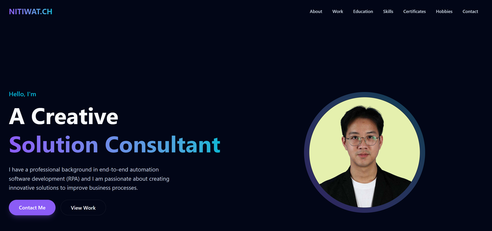

# Nitiwat.CH - Solution Consultant Portfolio



A modern, high-performance portfolio website for **Nitiwat Chunprapanusorn**, a Solution Consultant specializing in RPA, Process Improvement, and Web Development.

Built with a focus on premium aesthetics, smooth interactions, and responsive design to showcase professional achievements and skills.

## 🚀 Visit the Site

[Link to live site if applicable, or remove]

## 🛠️ Tech Stack

This project leverages the latest web technologies for optimal performance and developer experience:

- **Framework**: [Next.js 15](https://nextjs.org/) (App Router)
- **Language**: [TypeScript](https://www.typescriptlang.org/)
- **Styling**: [Tailwind CSS v4](https://tailwindcss.com/)
- **Animations**: [Framer Motion](https://www.framer.com/motion/)
- **Icons**: [Lucide React](https://lucide.dev/)
- **Font**: [Geist Sans](https://vercel.com/font)

## ✨ Features

- **Premium Dark Theme**: "Space/Dark" aesthetic with neon violet/cyan accents.
- **Smooth Navigation**: Sticky glassmorphism header and smooth scrolling sections.
- **Interactive UI**: Engaging micro-interaction and scroll animations.
- **Responsive Design**: Fully optimized for Desktop, Tablet, and Mobile devices.
- **Sections**:
  - **About**: Professional introduction with profile photo.
  - **Work History**: Vertical timeline of experience in RPA and Logistics.
  - **Education**: Academic background.
  - **Skills**: Categorized technical proficiencies (Automation, Programming, Web).
  - **Certificates**: Grid view of certifications with external links.
  - **Hobbies**: Personal interests.
  - **Contact**: Clean contact section with social links and location.

## 🏁 Getting Started

To run this project locally:

1.  **Clone the repository**:
    ```bash
    git clone https://github.com/yourusername/portfolio.git
    cd portfolio
    ```

2.  **Install dependencies**:
    ```bash
    npm install
    # or
    yarn install
    ```

3.  **Run the development server**:
    ```bash
    npm run dev
    ```

4.  **Open your browser**:
    Navigate to [http://localhost:3000](http://localhost:3000)

## 📬 Contact

- **Email**: [ch.nitiwat@gmail.com](mailto:ch.nitiwat@gmail.com)
- **LinkedIn**: [Nitiwat Chunprapanusorn](https://www.linkedin.com/in/nitiwat-chunprapanusorn-688045195/)
- **Location**: Bangkok, Thailand

---

© 2025 Nitiwat Chunprapanusorn. All rights reserved.
